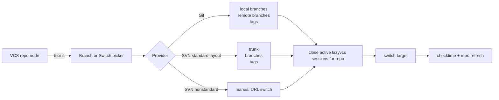

# lazyvcs.nvim

`lazyvcs.nvim` is a Neovim plugin for opening an editable live diff view with a
real file buffer on one side and a VCS base scratch buffer on the other.

It also ships a Neo-tree source-control view that can replace AstroNvim's stock
`Git` tab with a `VCS` sidebar for nested Git and SVN working copies.

It is designed for a lazy.nvim and AstroNvim workflow:

- Git first, using `git show :path` for the base and optional `gitsigns.nvim`
  integration for hunk reset
- SVN support through a plugin-owned backend using `svn cat -r BASE`
- native splits, native diff mode, and debounced `:diffupdate`
- nested source-control discovery for Git and SVN working copies

## Source Control Tab

When loaded with Neo-tree, `lazyvcs.nvim` can replace AstroNvim's `<Space>e`
`Git` tab with a VS Code-style `VCS` sidebar.

What it does:

- scans the current root for nested Git and SVN working copies
- also works when the current root is itself a single Git or SVN working copy
- renders a `Repositories` section and a `Changes` section, like VS Code SCM
- paints repo rows first, then hydrates repo status progressively in background jobs
- keeps multi-repo visibility state per root and restores it per workspace root
- renders right-aligned sync badges, branch labels, and primary action rows
- hides lower-priority metadata progressively when the pane is narrow so repo names stay readable
- opens changed files directly into `lazyvcs` live diff
- reuses the active `lazyvcs` editable diff window when you click another file from the VCS tree in the same tab
- pre-guards markdown targets during diff-session transfers so markdown-specific
  scope and Treesitter helpers do not break sequential file switching
- supports repo-scoped actions for refresh, sync/update, commit draft editing,
  branch switching, and AI-generated commit messages through `CopilotChat` when available
- runs VCS reads and long-lived repo actions such as refresh, sync, update, commit, fetch/pull/push, switch target discovery, and switch in the background so the editor stays responsive
- syncs Git like VS Code: pull from the selected branch's configured upstream, then push local commits when needed
- avoids bare `git pull` during sync/pull actions by fetching the configured upstream remote and fast-forwarding explicitly
- dims only the in-progress repo subtree while a mutation job is running, leaving other repos usable in the same VCS tab
- shows compact SVN labels such as `trunk`, `private/KMLopez/RP-2927`, or `integration/platform/OS/factory`

Branch switching flow:



Default source-control keys inside the sidebar:

- `<CR>` focus repos, expand change groups, run the primary action row, or open file diff
  The file-open path reuses the active `lazyvcs` diff pane when one is already open in the current tab.
- `<Space>` / `<Tab>` toggle repository visibility in the `Changes` section
- `H` toggle clean repos
- `R` refresh repo state
- `e` resize the Neo-tree window, except on commit-message rows where it edits the draft popup
- active `lazyvcs` diff sessions automatically rebalance to an even split after sidebar or editor width changes
- `gm` generate a commit subject with `CopilotChat`
- `b` open the branch or switch picker for the selected repo
- `s` open the sync/action picker
- `c` commit the selected repo
- `ga` stage a Git file
- `gu` unstage a Git file
- `gr` revert a Git or SVN file
- `v` toggle `Changes` between list and tree layout
- `S` cycle file sorting between path, name, and status

Layout details:

- `Repositories` shows every discovered working copy with focus and visibility markers.
- `Changes` shows the currently visible repositories.
- Each visible repo renders:
  - a commit-message row
  - a primary action row such as `Commit`, `Sync Changes`, `Publish Branch`, or `Update`
  - grouped changes such as `Merge Changes`, `Staged Changes`, `Changes`, `Untracked Changes`, or `Remote Changes`
- The commit row opens a popup editor instead of a plain `vim.ui.input` prompt.
- Git repo actions include `Checkout Branch or Tag...` with local branches, remote branches, tags, create-branch flows, and detached checkout.
- `Sync Changes` fetches the selected Git repo's upstream remote, fast-forwards with `git merge --ff-only <upstream>` when behind, pushes to the configured upstream when ahead, and refuses diverged branches.
- SVN repo actions include `Switch...`. Standard `trunk/branches/tags` layouts get a target list; nonstandard layouts fall back to a manual URL prompt.
- Background repo jobs replace the primary action label with status text such as `Syncing...`, `Updating...`, `Loading targets...`, `Switching...`, or `Committing...`.
- While a repo job is running, that repo stays navigable but its commit input, file diff opens, and repo action triggers are disabled until the job finishes.
- Status refreshes keep stale cached badges visible and show one quiet root-level refresh icon. Never-loaded repos still show a loading badge until their first status result arrives.
- `remote_refresh = "on_open"` is throttled by `remote_refresh_interval_ms` so repeated Neo-tree events do not restart network refresh every few seconds.
- All-repo remote refresh runs at lower priority than user-triggered repo expansion or switch-target loading.
- Pressing `<CR>` on an expanded repo node collapses it immediately, even if the repo details are stale after a sync/update. Pressing `<CR>` on a collapsed stale repo loads details and expands it.

## Controls and Usage

1. Restart Neovim if AstroNvim was already open before this plugin spec was added.
2. Open a versioned file that has local changes.
   For Git, any modified tracked file works.
   For SVN, open a file inside a working copy such as `~/Repos/SPI-1/platform/projects/...`.
3. Open the live diff view with one of:
   `:LazyVcsDiffOpen`
   `:VcsLiveDiffOpen`
   `<leader>vo`
4. Use the view:
   The left window is the real editable buffer.
   The right window is a scratch buffer showing the VCS base/original content.
   The diff updates as you edit, with a small debounce.
   `]v` and `[v` move between hunks and position the target hunk intentionally in the viewport.
5. Revert the current hunk with:
   `:LazyVcsRevertHunk`
   `<leader>vr`
6. Move between hunks with:
   `:LazyVcsNextHunk`
   `:LazyVcsPrevHunk`
   `]v`
   `[v`
7. Refresh manually if needed with:
   `:LazyVcsDiffRefresh`
8. Close the session with:
   `:LazyVcsDiffClose`
   `<leader>vq`
   `q` inside the live diff session
   `<leader>q` from the non-editable right/base diff window
9. If you switch to another buffer from the editable lazyvcs window, lazyvcs tears down the old diff pair, clears stale tab-local diff state, and reopens on the newly entered file when that file is supported by Git or SVN.
10. While a lazyvcs diff session is active, the scratch/base buffer opts out of Aerial, and editable-buffer transfers temporarily suspend then refetch Aerial so outline plugins do not race the session swap.
11. Markdown files entered through a lazyvcs session are guarded before the transfer completes so editor helpers do not leave the diff view in a broken intermediate state.

### Useful checks

- Run `:checkhealth lazyvcs` to verify Neovim version and Git/SVN/gitsigns availability.
- Run `:echo exists(':LazyVcsDiffOpen')` to confirm the command is available. A result of `2` means it is defined.

### Behavior notes

- Git compares against the index.
- SVN compares against working-copy `BASE`.
- If a file is untracked, the right side may be empty because there is no VCS base yet.
- If you revert the wrong hunk, use normal Neovim undo with `u`. Redo with `Ctrl-r`.
- When a hunk fits on screen, navigation centers the hunk block as much as possible. Oversized hunks start at the top of the viewport.
- Near the start or end of a file, viewport placement clamps naturally to the available lines.
- Switching to another buffer from the editable window performs a clean tab-local diff reset before reopening lazyvcs on the destination file.
- Unsupported or non-file destination buffers close the old session without reopening it.
- While a lazyvcs session is active, lazyvcs owns diff mode in the current tab so stale diff participants do not leak across buffer transfers.
- When the VCS sidebar or editor width changes, the active diff pair rebalances itself to an even split across the remaining space.
- Closing or changing the Neo-tree VCS root cancels stale background status reads. Explicit sync/update/commit/switch jobs continue until the VCS command exits.
- User-triggered detail and switch-target loads take priority over all-repo background remote refresh, so the VCS tab remains navigable while a repo sync/update refreshes other repos.
- Background refresh preserves cached repo icons, branch names, and sync counts so unsynced repos do not visually disappear while another repo finishes syncing.
- Background refresh state is shown once on the root row as a quiet icon, avoiding per-row and per-section flicker.
- Failed background mutation jobs keep an inline error badge on the repo row until the next refresh or successful repo action.
- Failed background remote refreshes keep inline error state and emit one summary notification per refresh batch by default.

## Commands

- `:LazyVcsDiffOpen`
- `:LazyVcsDiffClose`
- `:LazyVcsDiffToggle`
- `:LazyVcsDiffRefresh`
- `:LazyVcsRevertHunk`
- `:LazyVcsNextHunk`
- `:LazyVcsPrevHunk`
- `:LazyVcsSourceControlProfile` show recent source-control job timings
- `:VcsLiveDiffOpen`

## Default AstroNvim Mappings

- `<leader>vo` open live diff
- `<leader>vq` close live diff
- `<leader>vr` revert current hunk
- `]v` next hunk
- `[v` previous hunk

## Setup

### Generic lazy.nvim setup

Use a normal plugin spec if you are installing from a repository:

```lua
{
  "yourname/lazyvcs.nvim",
  dependencies = {
    "lewis6991/gitsigns.nvim",
    "nvim-neo-tree/neo-tree.nvim",
  },
  cmd = {
    "LazyVcsDiffOpen",
    "LazyVcsDiffClose",
    "LazyVcsDiffToggle",
    "LazyVcsDiffRefresh",
    "LazyVcsRevertHunk",
    "LazyVcsNextHunk",
    "LazyVcsPrevHunk",
    "LazyVcsSourceControlProfile",
    "VcsLiveDiffOpen",
  },
  opts = {
    debounce_ms = 120,
    use_gitsigns = true,
    set_winbar = true,
    session_keymaps = true,
    base_window = {
      width = 0.45, -- ratio when <= 1, fixed columns when > 1
    },
    source_control = {
      enabled = true,
      scan_depth = 3,
      show_clean = false,
      always_show_repositories = false,
      selection_mode = "multiple",
      repositories_sort = "discovery_time",
      changes_view_mode = "list",
      changes_sort = "path",
      compact_folders = true,
      show_action_button = true,
      show_input_action_button = true,
      remote_refresh = "on_open",
      remote_refresh_interval_ms = 60000,
      selector_label = "VCS",
      sync_button_behavior = "picker",
      remote_error_notifications = "summary",
      background = {
        git_workers = 4,
        svn_workers = 1,
        status_timeout_ms = 30000,
        remote_timeout_ms = 30000,
        switch_timeout_ms = 30000,
        mutation_timeout_ms = 0,
        history_limit = 100,
      },
    },
    ai = {
      commit_message = {
        provider = "copilotchat",
      },
    },
  },
}
```

### Local development setup with AstroNvim

```lua
{
  dir = "/home/kevim/Repos/lazyvcs.nvim",
  name = "lazyvcs.nvim",
  main = "lazyvcs",
  dependencies = {
    "lewis6991/gitsigns.nvim",
    "nvim-neo-tree/neo-tree.nvim",
  },
  cmd = {
    "LazyVcsDiffOpen",
    "LazyVcsDiffClose",
    "LazyVcsDiffToggle",
    "LazyVcsDiffRefresh",
    "LazyVcsRevertHunk",
    "LazyVcsNextHunk",
    "LazyVcsPrevHunk",
    "LazyVcsSourceControlProfile",
    "VcsLiveDiffOpen",
  },
  opts = {
    debounce_ms = 120,
    use_gitsigns = true,
    base_window = {
      width = 0.45, -- ratio when <= 1, fixed columns when > 1
    },
    source_control = {
      enabled = true,
      scan_depth = 3,
      show_clean = false,
      always_show_repositories = false,
      selection_mode = "multiple",
      repositories_sort = "discovery_time",
      changes_view_mode = "list",
      changes_sort = "path",
      compact_folders = true,
      show_action_button = true,
      show_input_action_button = true,
      remote_refresh = "on_open",
      remote_refresh_interval_ms = 60000,
      selector_label = "VCS",
      sync_button_behavior = "picker",
      remote_error_notifications = "summary",
      background = {
        git_workers = 4,
        svn_workers = 1,
        status_timeout_ms = 30000,
        remote_timeout_ms = 30000,
        switch_timeout_ms = 30000,
        mutation_timeout_ms = 0,
        history_limit = 100,
      },
    },
  },
}
```

After adding the plugin spec, restart Neovim or reload your lazy.nvim setup before using the commands.

To replace AstroNvim's selector tab, add a Neo-tree override that labels the
source as `VCS` and points it at the external `lazyvcs` source:

```lua
{
  "nvim-neo-tree/neo-tree.nvim",
  opts = function(_, opts)
    local get_icon = require("astroui").get_icon
    opts.sources = opts.sources or {}

    local function ensure_source(list, value)
      for _, item in ipairs(list) do
        if item == value then
          return
        end
      end
      list[#list + 1] = value
    end

    ensure_source(opts.sources, "git_status")
    ensure_source(opts.sources, "lazyvcs.source_control")

    opts.source_selector = opts.source_selector or {}
    opts.source_selector.sources = opts.source_selector.sources or {}
    for index, item in ipairs(opts.source_selector.sources) do
      if item.source == "git_status" then
        opts.source_selector.sources[index] = {
          source = "lazyvcs_source_control",
          display_name = get_icon("Git", 1, true) .. "VCS",
        }
      end
    end
  end,
}
```

## Health

Run `:checkhealth lazyvcs` to verify Neovim version and Git/SVN/gitsigns availability.

## Tests

Run the headless test suite with:

```sh
nvim --headless -u NONE -l /home/kevim/Repos/lazyvcs.nvim/tests/run.lua
```

Format and lint with locally available tools:

```sh
/home/kevim/.local/share/nvim/mason/bin/stylua /home/kevim/Repos/lazyvcs.nvim
/home/kevim/.local/share/nvim/mason/bin/lua-language-server --check=/home/kevim/Repos/lazyvcs.nvim --check_format=pretty --checklevel=Warning
nvim --headless -u NONE -l /home/kevim/Repos/lazyvcs.nvim/tests/run.lua
```
