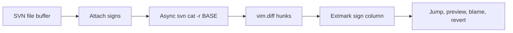
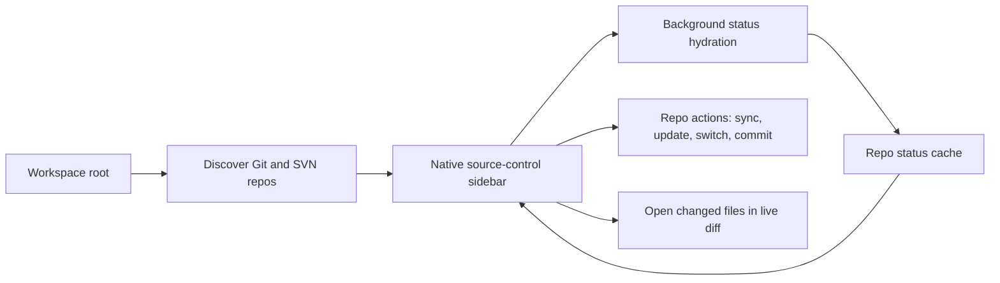
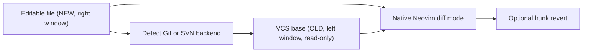

# lazyvcs.nvim

[](https://github.com/Reddimus/lazyvcs.nvim/actions/workflows/ci.yml)

`lazyvcs.nvim` gives Neovim native VCS workflows:

- SVN gutter signs, hunk navigation, blame, line log, and file picker
- an editable live diff view for the current Git/SVN file
- a standalone source-control sidebar for nested Git/SVN working copies

It does not require Neo-tree. It works in vanilla Neovim, lazy.nvim, and
AstroNvim.

## Requirements

- Neovim 0.11+
- `git` for Git repositories
- `svn` for SVN working copies
- A Nerd Font is recommended for sidebar icons

Linux, macOS, and Windows are all supported. CI runs the suite against Neovim
0.11.0, 0.11.7, and 0.12.4 on Linux, 0.11.7 and 0.12.4 on Windows, and 0.12.4 on
macOS. WSL is covered by the Linux builds.

## Install

Use the same plugin spec in lazy.nvim or AstroNvim. This is the vanilla install:

```lua
{
  "Reddimus/lazyvcs.nvim",
  main = "lazyvcs",
  event = { "BufReadPost", "BufNewFile" },
  dependencies = {
    { "lewis6991/gitsigns.nvim", optional = true },
    { "folke/snacks.nvim", optional = true },
    { "ibhagwan/fzf-lua", optional = true },
    { "CopilotC-Nvim/CopilotChat.nvim", optional = true },
  },
  cmd = { "LazyVCS" },
  keys = {
    { "<leader>vs", "<cmd>LazyVCS<cr>", desc = "Toggle VCS sidebar" },
    { "<leader>vo", "<cmd>LazyVCS diff open<cr>", desc = "Open VCS diff" },
    { "<leader>vq", "<cmd>LazyVCS diff close<cr>", desc = "Close VCS diff" },
    { "<leader>vr", "<cmd>LazyVCS hunk revert<cr>", desc = "Revert VCS hunk" },
    { "<leader>vb", "<cmd>LazyVCS blame toggle<cr>", desc = "Toggle VCS blame" },
    { "]v", "<cmd>LazyVCS hunk next<cr>", desc = "Next VCS hunk" },
    { "[v", "<cmd>LazyVCS hunk prev<cr>", desc = "Previous VCS hunk" },
  },
  opts = {
    source_control = {
      enabled = true,
      ui = "auto",
      remote_refresh = "on_open",
      remote_refresh_interval_ms = 60000,
    },
  },
}
```

Vanilla mode has no plugin dependencies. The `optional = true` dependency specs
above do not install anything by themselves. If `gitsigns.nvim`, `snacks.nvim`,
`fzf-lua`, or `CopilotChat.nvim` are already installed elsewhere in your config,
LazyVCS detects them at runtime and uses enhanced paths automatically. Supported
AI CLIs are also detected for `ai.commit_message.provider = "auto"`.

For local development, replace the repo string with your checkout path:

```lua
dir = "/path/to/lazyvcs.nvim"
```

Run `:checkhealth lazyvcs` after installation.

For AstroNvim, place the same spec in `lua/plugins/lazyvcs.lua`. The `event`
entry is important: it loads LazyVCS when files open so SVN gutter signs and
inline blame autocmds are available without first running a command.

## Vanilla vs Enhanced

The base install has no hard UI dependencies. If none of the recommended plugins
are installed, lazyvcs runs in `vanilla` mode with built-in Neovim fallbacks.

If any recommended plugin is already installed, lazyvcs uses it automatically
and reports `enhanced` mode in `:checkhealth lazyvcs`.

Optional integrations:

- `gitsigns.nvim`: Git hunk reset delegation
- `snacks.nvim`: action picker, VS Code-style Git branch picker, and SVN file
  pickers
- `fzf-lua`: SVN file picker fallback
- `CopilotChat.nvim`, Claude CLI, Codex CLI, Gemini CLI, or GitHub Copilot CLI:
  `gm` commit-message generation

To install every enhanced integration with lazyvcs, remove `optional = true` and
add dependencies explicitly:

```lua
dependencies = {
  "lewis6991/gitsigns.nvim",
  "folke/snacks.nvim",
  "ibhagwan/fzf-lua",
  "CopilotC-Nvim/CopilotChat.nvim",
}
```

## SVN Inline Signs

SVN file buffers get gutter signs automatically. LazyVCS compares the buffer
against working-copy `BASE` in the background and updates signs after edits.


```mermaid
flowchart LR
  Buffer[SVN file buffer] --> Attach[Attach signs]
  Attach --> Base[Async svn cat -r BASE]
  Base --> Hunk[vim.diff hunks]
  Hunk --> Signs[Extmark sign column]
  Signs --> Actions[Jump, preview, blame, revert]
```

Useful commands:

| Command                  | Description                           |
| ------------------------ | ------------------------------------- |
| `:LazyVCS signs refresh` | Reload the VCS base and refresh signs |
| `:LazyVCS blame toggle`  | Toggle global inline Git/SVN blame    |
| `:LazyVCS blame split`   | Toggle full-file Git/SVN blame split  |
| `:LazyVCS blame clear`   | Disable global inline blame           |
| `:LazyVCS blame log`     | Show Git/SVN log for the current line |
| `:LazyVCS preview`       | Preview the current buffer diff       |
| `:LazyVCS revert`        | Revert the current file               |
| `:LazyVCS files`         | Pick from changed files               |
| `:LazyVCS hunk revert`   | Revert current hunk                   |
| `:LazyVCS hunk next`     | Jump to next hunk                     |
| `:LazyVCS hunk prev`     | Jump to previous hunk                 |

## Source-Control Sidebar

Open it with:

```vim
:LazyVCS
```

The sidebar:

- scans the current root for nested Git and SVN repos
- supports broad workspace roots such as `~/src`
- disambiguates duplicate repo names with relative paths
- shows `Repositories` and `Changes`
- hydrates repo status in background jobs
- keeps other repos usable while one repo syncs, updates, commits, or switches
- keeps cached repo badges visible during refresh
- supports Git fetch/pull/push/sync and SVN update/switch
- publishes no-upstream Git branches with upstream tracking
- uses `origin` for publishing, or the only configured remote when `origin` is
  absent
- opens changed files in the live diff view


```mermaid
flowchart LR
  Root[Workspace root] --> Discover[Discover Git and SVN repos]
  Discover --> Sidebar[Native source-control sidebar]
  Sidebar --> Hydrate[Background status hydration]
  Hydrate --> Cache[Repo status cache]
  Cache --> Sidebar
  Sidebar --> Actions[Repo actions: sync, update, switch, commit]
  Sidebar --> Diff[Open changed files in live diff]
```

Sidebar keys:

| Key                 | Action                                                              |
| ------------------- | ------------------------------------------------------------------- |
| `<CR>` / `l`        | Focus repo, toggle Changes repo rows, run action, or open file diff |
| `h`                 | Collapse node                                                       |
| `<Space>` / `<Tab>` | Toggle repo visibility; expand/collapse section rows                |
| `R`                 | Refresh                                                             |
| `H`                 | Toggle clean repos                                                  |
| `e`                 | Edit commit message, or toggle auto-fit width                       |
| `b`                 | Switch Git branch/tag or SVN target                                 |
| `s` / `.`           | Open repo actions                                                   |
| `c`                 | Commit repo                                                         |
| `gm`                | Generate commit message                                             |
| `ga` / `gu` / `gr`  | Stage, unstage, or revert file                                      |
| `v`                 | Toggle list/tree layout                                             |
| `S`                 | Cycle file sort                                                     |
| `X`                 | Cancel in-flight work for the repo under the cursor                 |

`e` auto-fit expands the sidebar up to
`source_control.auto_expand_max_width_ratio` of the editor width, then restores
the previous width when toggled again.

With `snacks.nvim` installed, `b` opens a VS Code-style Git branch picker with
commands pinned first, current branch marked, and no numeric prefixes. Without
Snacks, lazyvcs falls back to the built-in `vim.ui.select`.

Commit messages can be generated from the sidebar with `gm` or from the commit
popup with `gm` in normal mode / `<C-g>` in insert mode. The default provider is
`CopilotChat.nvim`; set `ai.commit_message.provider = "auto"` to try
CopilotChat, Claude CLI, Codex CLI, Gemini CLI, then GitHub Copilot CLI. LazyVCS
asks once per session before sending diffs to an AI provider.

```lua
opts = {
  ai = {
    commit_message = {
      provider = "auto",
      instructions = "Use imperative mood and include a ticket ID when present.",
    },
  },
}
```

## Live Diff

Open a live diff for the current file:

```vim
:LazyVCS diff open
```

The left window is a read-only scratch buffer holding the VCS base (the **old**
version); the right window is the real editable file (your **new** changes).
This follows the convention shared by git, VS Code, GitHub, and `vimdiff` — old
on the left, new on the right, so the diff reads old → new left → right:

- Git compares against the index with `git show :path`
- SVN compares against working-copy `BASE` with `svn cat -r BASE`
- Git untracked files and SVN added files show an empty base
- `]v` and `[v` move between hunks
- `:LazyVCS hunk revert` or `<leader>vr` reverts the current hunk
- normal undo still works if you revert the wrong hunk

When the active editor window changes buffers, such as with AstroNvim `]b`,
`[b`, or tabline buffer picking, LazyVCS reopens the live diff for supported
Git/SVN buffers and closes the session cleanly for unsupported buffers.

LazyVCS mirrors the editable window's `wrap`, `linebreak`, and `breakindent`
settings to the read-only base window. Native Neovim diff mode disables wrapping
unless `followwrap` is present in `diffopt`, so add it in your Neovim or
AstroNvim options to preserve wrapping:

```lua
vim.opt.diffopt:append("followwrap")
```

LazyVCS does not change `diffopt`. With `followwrap`, corresponding lines can
occupy different screen heights and appear visually misaligned when they wrap at
different points.


```mermaid
flowchart LR
  File["Editable file (NEW, right window)"] --> Detect[Detect Git or SVN backend]
  Detect --> Base["VCS base (OLD, left window, read-only)"]
  File --> Diff[Native Neovim diff mode]
  Base --> Diff
  Diff --> Revert[Optional hunk revert]
```

## Commands

| Command                            | Description                          |
| ---------------------------------- | ------------------------------------ |
| `:LazyVCS`                         | Toggle the source-control sidebar    |
| `:LazyVCS sidebar open [path]`     | Open sidebar                         |
| `:LazyVCS sidebar close`           | Close sidebar                        |
| `:LazyVCS sidebar toggle [path]`   | Toggle sidebar                       |
| `:LazyVCS sidebar refresh`         | Refresh sidebar                      |
| `:LazyVCS sidebar cancel [path]`   | Cancel in-flight source-control work |
| `:LazyVCS diff open`               | Open live diff                       |
| `:LazyVCS diff close`              | Close live diff                      |
| `:LazyVCS diff toggle`             | Toggle live diff                     |
| `:LazyVCS diff refresh`            | Refresh live diff                    |
| `:LazyVCS hunk next` / `hunk prev` | Move between hunks                   |
| `:LazyVCS hunk revert`             | Revert current hunk                  |
| `:LazyVCS blame toggle`            | Toggle global inline Git/SVN blame   |
| `:LazyVCS blame split`             | Toggle aligned Git/SVN blame split   |
| `:LazyVCS blame clear`             | Disable global inline blame          |
| `:LazyVCS blame log`               | Show Git/SVN log for current line    |
| `:LazyVCS signs refresh`           | Refresh gutter signs                 |
| `:LazyVCS preview`                 | Preview the current buffer diff      |
| `:LazyVCS revert`                  | Revert the current file              |
| `:LazyVCS files`                   | Browse changed files                 |
| `:LazyVCS profile [show\|clear]`   | Show or clear job timings            |
| `:LazyVCS health`                  | Run `:checkhealth lazyvcs`           |

## Suggested keymaps

These are the bindings used by the install snippet above and by the test suite.
Nothing is mapped unless you declare it in your own `keys` table, so change them
freely.

| Key          | Action                        |
| ------------ | ----------------------------- |
| `<leader>vs` | Toggle source-control sidebar |
| `<leader>vo` | Open live diff                |
| `<leader>vq` | Close live diff               |
| `<leader>vr` | Revert the current hunk       |
| `<leader>vb` | Toggle inline blame           |
| `<leader>vf` | Browse changed files          |
| `]v` / `[v`  | Next / previous hunk          |

Every subcommand works in both Git and SVN working copies. Press `<Tab>` after
`:LazyVCS ` to complete subcommands, and again to complete each one's verbs.

## Configuration

Defaults are intentionally conservative:

```lua
require("lazyvcs").setup({
  debounce_ms = 120,
  use_gitsigns = true,
  set_winbar = true,
  session_keymaps = true,
  base_window = {
    width = 0.5,
  },
  signs = {
    enabled = true,
    debounce_ms = 120,
    sign_priority = 6,
    max_file_bytes = 1024 * 1024,
    text = {
      add = "┃",
      change = "┃",
      delete = "_",
      topdelete = "‾",
      changedelete = "~",
    },
  },
  blame = {
    mode = "inline", -- "inline", "split", or "off"
    persist = true, -- remember the inline blame on/off toggle across sessions
    delay_ms = 150, -- debounce before the first blame fetch (the overlay then follows the cursor instantly)
    loading_delay_ms = 750,
    loading_text = "Blame loading...",
    uncommitted_text = "Uncommitted line",
    format = "{author}, {date} - r{revision}",
    max_width = 80,
    split_min_width = 20,
    split_max_width = 34,
  },
  keymaps = {
    close = "q", -- any of these may be `false` to leave the key unmapped
    next_hunk = "]v",
    prev_hunk = "[v",
    revert_hunk = "<leader>vr",
  },
  source_control = {
    enabled = true,
    ui = "auto",
    scan_depth = 3,
    width = 38,
    auto_expand_width = false,
    auto_expand_max_width_ratio = 0.5,
    show_clean = false,
    confirm_mutations = true,
    remote_refresh = "manual",
    remote_refresh_interval_ms = 60000,
    sync_button_behavior = "picker",
    always_show_repositories = false,
    selection_mode = "multiple",
    repositories_sort = "discovery_time",
    changes_view_mode = "list",
    changes_sort = "path",
    compact_folders = true,
    show_action_button = true,
    show_input_action_button = true,
    remote_error_notifications = "summary", -- "summary", "inline", or "notify"
    background = {
      git_workers = 4,
      svn_workers = 1,
      status_timeout_ms = 30000,
      remote_timeout_ms = 30000,
      switch_timeout_ms = 30000,
      mutation_timeout_ms = 120000, -- must be > 0; see the note below
      history_limit = 100,
    },
  },
  ai = {
    commit_message = {
      provider = "copilotchat",
      provider_order = { "copilotchat", "claude", "codex", "gemini", "copilot_cli" },
      instructions = "",
      timeout_ms = 30000,
      max_context_chars = 12000,
      context = "staged_first", -- "staged_first", "staged", "unstaged", "all", or "status"
      generate_key = "gm",
      insert_generate_key = "<C-g>",
      confirm_privacy = true,
    },
  },
})
```

Unknown or removed options are reported once at startup with `vim.notify_once`,
so a stale config tells you which keys to drop rather than failing silently.

Important signs options:

| Option                 | Meaning                               |
| ---------------------- | ------------------------------------- |
| `signs.enabled`        | Enable SVN gutter signs               |
| `signs.debounce_ms`    | Delay sign refresh after buffer edits |
| `signs.sign_priority`  | Sign-column priority                  |
| `signs.max_file_bytes` | Skip large files                      |
| `signs.text.*`         | Customize sign glyphs                 |

Live-diff keymaps:

| Option                | Meaning                          |
| --------------------- | -------------------------------- |
| `keymaps.close`       | Close the live diff session      |
| `keymaps.next_hunk`   | Jump to the next hunk            |
| `keymaps.prev_hunk`   | Jump to the previous hunk        |
| `keymaps.revert_hunk` | Revert the hunk under the cursor |

Each accepts a string or `false` to leave the key unmapped. Empty strings are
rejected, and two keymaps bound to the same key is a configuration error.

Important blame options:

| Option                   | Meaning                                                                             |
| ------------------------ | ----------------------------------------------------------------------------------- |
| `blame.mode`             | `inline`, `split`, or `off` for `:LazyVCS blame toggle`                             |
| `blame.persist`          | Remember the inline blame on/off toggle across sessions                             |
| `blame.delay_ms`         | Debounce before the first blame fetch; the overlay then tracks the cursor instantly |
| `blame.loading_delay_ms` | Delay before showing slow-load feedback                                             |
| `blame.loading_text`     | Muted text shown while slow blame is still loading                                  |
| `blame.uncommitted_text` | Muted text for local/uncommitted blame rows                                         |
| `blame.format`           | Inline text with `{author}`, `{date}`, `{revision}`, `{summary}`, or `{backend}`    |
| `blame.max_width`        | Maximum inline blame text width                                                     |
| `blame.split_min_width`  | Minimum full-file blame split width                                                 |
| `blame.split_max_width`  | Maximum full-file blame split width                                                 |

Terminal Neovim cannot apply true per-text opacity. LazyVCS uses muted,
theme-aware `Comment` highlights for blame text instead. Inline blame stays
quiet during fast loads, shows `Blame loading...` only for slow SVN calls, and
labels local SVN rows as `Uncommitted line` instead of displaying raw `- - -`
placeholders. SVN added files use the same uncommitted-line display.

`:LazyVCS blame toggle` is a single global toggle: enabling it shows the overlay
in every supported Git or SVN buffer, and the cursor-follow render is instant
because full-file blame is fetched once per buffer and cached. With
`blame.persist = true` (the default) the on/off choice is saved to
`stdpath("state")/lazyvcs/state.json` and restored on the next launch, so blame
"shows again" automatically.

Important source-control options:

| Option                        | Meaning                                                  |
| ----------------------------- | -------------------------------------------------------- |
| `scan_depth`                  | Nested repo discovery depth                              |
| `width`                       | Initial sidebar width                                    |
| `auto_expand_max_width_ratio` | Width cap used by `e` auto-fit                           |
| `show_clean`                  | Show clean repos by default                              |
| `remote_refresh`              | `manual` or `on_open`                                    |
| `selection_mode`              | `multiple` or `single` visible repos                     |
| `changes_view_mode`           | `list` or `tree`                                         |
| `changes_sort`                | `path` or `status`                                       |
| `confirm_mutations`           | Confirm repo/file mutations                              |
| `sync_button_behavior`        | `picker` or `sync` for the Sync button                   |
| `always_show_repositories`    | Keep the Repositories section visible even with one repo |
| `repositories_sort`           | `discovery_time`, `name`, or `path`                      |
| `compact_folders`             | Collapse single-child folders in tree view               |
| `show_action_button`          | Show the sidebar action button                           |
| `show_input_action_button`    | Show the action button in the commit input               |
| `remote_error_notifications`  | `summary`, `inline`, or `notify`                         |

Background scheduling (`source_control.background`):

| Option                | Meaning                                              |
| --------------------- | ---------------------------------------------------- |
| `git_workers`         | Concurrent Git subprocesses                          |
| `svn_workers`         | Concurrent SVN subprocesses                          |
| `status_timeout_ms`   | Timeout for status/hydration commands                |
| `remote_timeout_ms`   | Timeout for fetch and remote-status commands         |
| `switch_timeout_ms`   | Timeout for branch/ref switching                     |
| `mutation_timeout_ms` | Timeout for stage, commit, push, and other mutations |
| `history_limit`       | Entries retained for `:LazyVCS profile`              |

Every scheduled command is cancellable and bounded. `mutation_timeout_ms` must
be greater than zero — a mutation that hangs forever cannot be distinguished
from one still in progress, so `0` is rejected at setup.

AI commit messages (`ai.commit_message`):

| Option                | Meaning                                                  |
| --------------------- | -------------------------------------------------------- |
| `provider`            | Provider name, or `auto` to try `provider_order`         |
| `provider_order`      | Providers tried in order when `provider = "auto"`        |
| `instructions`        | Extra instructions appended to the prompt                |
| `timeout_ms`          | Provider timeout                                         |
| `max_context_chars`   | Diff context is truncated to this length                 |
| `context`             | `staged_first`, `staged`, `unstaged`, `all`, or `status` |
| `generate_key`        | Normal-mode key in the commit input                      |
| `insert_generate_key` | Insert-mode key in the commit input                      |
| `confirm_privacy`     | Confirm before sending diff content to a provider        |

Diff context is passed to providers over stdin, or as a private `0600`
attachment that is deleted on completion, so it never appears in process
arguments or task listings.

Mutation confirmations use a small native popup. Press `1` to confirm, `2` to
confirm and skip more mutation prompts for the current Neovim session, or `3`,
`q`, or `<Esc>` to cancel. `j`/`k` and arrow keys move the selection; `<CR>`
runs the highlighted choice. `Confirm` is highlighted by default.

## Migrating From The Old Neo-tree Adapter

The Neo-tree adapter has been removed. Delete any `lazyvcs.source_control`
Neo-tree source config and any `lazyvcs_source_control` selector entry.

Use:

```vim
:LazyVCS
```

## Health

Run `:checkhealth lazyvcs` to verify Neovim, Git/SVN, and optional integration
availability.

Subversion is optional. lazyvcs is Git-first: when the `svn` executable is not
present the SVN backend is skipped silently, and Git diff/source-control
workflows continue to work normally.

## Tests

Local checks:

```sh
nvim --headless -u NONE -l tests/native_smoke.lua
nvim --headless -u NONE -l tests/run.lua
tests/minitest.sh
nvim --headless -u NONE -c 'helptags doc' -c 'quitall'
nvim --headless -u NONE -c 'checkhealth lazyvcs' -c 'quitall'
stylua --check lua tests
lua-language-server --check=. --check_format=pretty --checklevel=Warning
npm ci
npm run format:md:check
npm run lint:md
npm run lint:links
npm run audit
actionlint
shellcheck tests/minitest.sh tests/ci/install-neovim.sh tests/e2e/*.sh
bash -n tests/minitest.sh tests/ci/install-neovim.sh tests/e2e/*.sh
```

CI pins StyLua 2.5.2 and lua-language-server 3.18.2; `lua-language-server` needs
`VIMRUNTIME` exported. On Windows, run the sidebar suite as
`nvim --headless -u NONE -l tests/minitest.lua` with `MINI_TEST_PATH` set, since
`tests/minitest.sh` requires bash.

Container checks:

```sh
tests/e2e/ubuntu-native.sh
tests/e2e/ubuntu-astronvim.sh
```

Each test runs in isolation. The runner prints a `PASS` / `SKIP` / `FAIL` line
per test and a final `N passed, N skipped, N failed` summary. SVN tests require
the `svnadmin` binary; when Subversion is not installed they are reported as
`SKIP` (not a failure) so the Git suite still runs and passes. The process exits
non-zero if any test fails, so it is safe to use in CI.

The native container test includes a fixed-size `pexpect` terminal smoke test
for the sidebar. `tests/minitest.sh` fetches `mini.nvim` into ignored `deps/`
unless `MINI_TEST_PATH` points to an existing checkout.

Forge Terminal MCP can help with local agent-driven TUI debugging, but it is not
required for tests or CI.
